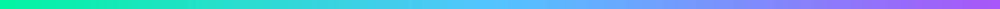
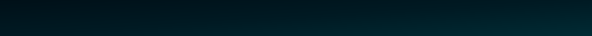
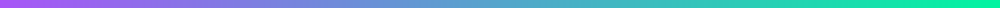

<!-- Header Wave Gradient -->

  

<!-- Strip gradient (looks like colored background) -->

<!-- Typing -->

  

<!-- Social -->

  
  

<!-- Panel Tentang Saya -->

<h2 align="center">🚀 Tentang Saya</h2>

💻 <b>Web Developer & IoT Enthusiast</b>  •  🌱 Belajar <b>Arduino</b>, <b>ESP32</b>, <b>Web Dev</b>  •  ⚡ Fokus: <b>PHP</b>, <b>JavaScript</b>, <b>IoT</b> 
🎯 Misi: Membangun solusi yang bermanfaat & scalable.

<!-- Pemisah Statistik -->

<h2 align="center">📊 Statistik</h2>

  
  

<!-- Panel untuk Activity Graph / Top Languages -->

<h2 align="center">🌌 Activity Graph & Top Languages</h2>

  

  

<!-- Tools (reuse bg3 strip as divider) -->

<h2 align="center">🛠️ Tools & Bahasa</h2>

  

<!-- GIF panel (reuse bg2 panel for consistency) -->

<h2 align="center">🎬 Sedang Dikerjakan</h2>

  

<!-- Contact (reuse bg1 strip) -->

<h2 align="center">📫 Kontak</h2>

  📷 Instagram: <a href="https://instagram.com/yogaasz">@yogaasz</a> &nbsp;•&nbsp;
  💻 GitHub: <a href="https://github.com/Yoganugroho387">Yoganugroho387</a>

<!-- Footer Wave -->

  

